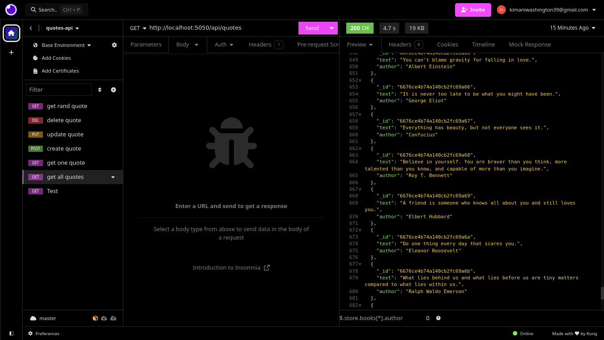

# Hello, yet another CRUD RESTful API
```javascript
//sidenote: I am having way too much fun with these
```

Anyways, here goes everything.
## Have Fun


## Here are the environment variables that you will need.

```bash
MONGO_URL = 
PORT= 
```